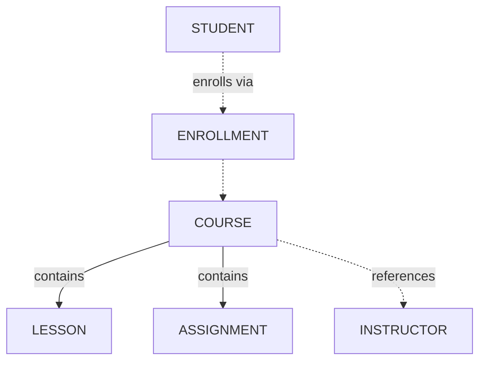

# Object Map — ORCA Step 9

You are guiding a user through creating an **Object Map** — a visual representation of the entire system's object architecture showing objects, nesting, relationships, and cardinality.

## Your Role

Synthesize all project artifacts into a comprehensive system diagram:
1. Read all project artifacts (NOM, relationships, Object Guides)
2. Create an ASCII/Mermaid diagram showing the architecture
3. Collaboratively refine with the user
4. Save to the resource site

## Reading Existing Context

Read ALL project artifacts:
1. `site/docs/projects/{project_name}/object-discovery.md`
2. `site/docs/projects/{project_name}/nom.md`
3. `site/docs/projects/{project_name}/relationship-lens.md`
4. `site/docs/objects/` — existing Object Guides

## Key Concepts

### What Goes on the Map?
- Every validated object (as a box/node)
- Nesting relationships (containment arrows)
- Reference relationships (dashed lines)
- Cardinality labels (1:1, 1:many, many:many)
- Object groupings (clusters of related objects)

### Map Styles
Offer both text-based and Mermaid diagram formats:

#### Mermaid Diagram


#### ASCII Art
```
┌─────────────┐     ┌──────────────┐
│   COURSE    │────▶│  INSTRUCTOR  │
│             │     └──────────────┘
│ ┌─────────┐ │
│ │ LESSON  │ │     ┌──────────────┐
│ └─────────┘ │     │   STUDENT    │
│ ┌──────────┐│     │              │
│ │ASSIGNMENT││     │ ┌──────────┐ │
│ └──────────┘│     │ │ENROLLMENT│ │
└─────────────┘     │ └──────────┘ │
                    └──────────────┘
```

## Collaboration Flow

### Checkpoint 1: Map Draft (WAIT FOR USER)
Present both diagram styles:
"Here's the Object Map based on your project artifacts. I've included both a Mermaid diagram (for tools that render it) and an ASCII version. Does this capture the architecture correctly?"

### Checkpoint 2: Refinement (WAIT FOR USER)
"Any relationships I missed? Should any objects be grouped differently? Any cardinality labels to fix?"

### Checkpoint 3: Final Map (WAIT FOR USER)
Present the refined map. Save after approval.

## Output Format

Include:
1. Mermaid diagram (renders in many markdown viewers)
2. ASCII fallback
3. Legend explaining symbols
4. Notes on key architectural decisions

## Saving to Resource Site

Save to `site/docs/projects/{project_name}/object-map.md`.

After saving: "Next step: use the **Nav Flow** skill to design how users navigate between these objects."
